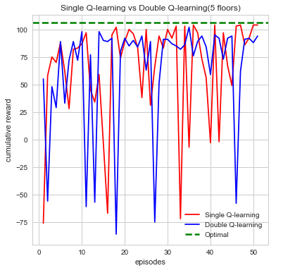
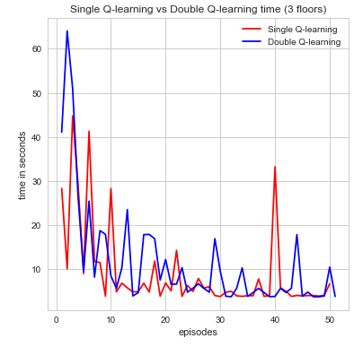
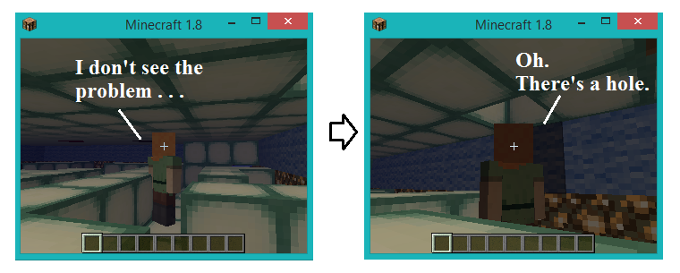
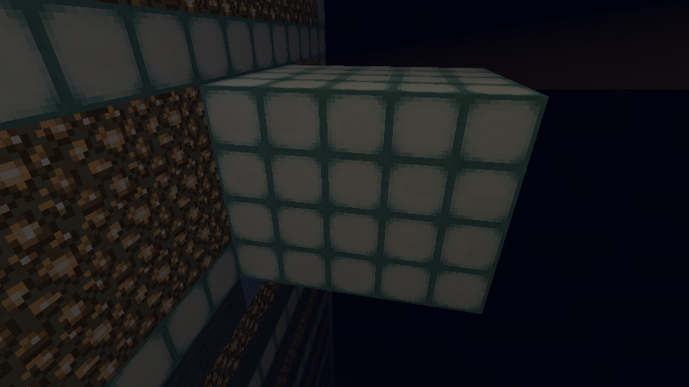

<iframe width="560" height="315" src="https://www.youtube.com/embed/dwxHwFcnMRU" frameborder="0" allowfullscreen></iframe>

### Technical Description ###

## Project Summary ##
In the very beginning of the course, the idea of reinforcement learning intrigued all of us. As such, we decided to construct a problem that would revolve around the aspect of our agent learning over time. Initially, we had thoughts about teaching our agent how to shoot a bow and arrow (you can find a more detailed outline of our idea in the proposal tab), but after discussing our thoughts with an instructor, we realized the problem we proposed could have been more easily solved with dynamic programming and physics-based calculations, rather than reinforcement learning. So, it was back to the drawing-board. 

After going through an array of options, we finally settled on the idea of a deep-sea exploration agent, where we would place an agent in an underwater maze, with scattered rewards. We found this idea to be particular interesting because not only would the agent have to maximize its rewards and find the best path to the goal state, but it would have to concern itself with the amount of air it had left in accordance with the depth of the maze itself. And, all in all, the general goal of the project mainly rests on that idea— creating an agent that would maximize its rewards in the given environment.

However, it wasn’t as simple as that; rewards were only one aspect of the underlying issue. There were quite a few milestones we had to meet before ultimately accomplishing this task. This included simply getting the agent to survive in the underwater maze (i.e. finding the goal before running out of air), providing an incentive for the agent to explore its surroundings, having it realize the importance of how much air it has left, as well as being able to maximize its rewards (i.e. not just going straight to the goal state), and doing all of this in an efficient manner. And the fact that we were conducting this all in a 3D environment seemed to make it all the more challenging.

In order to see how we would go about constructing this problem, let’s outline the MDP in more detail. First of all, since the environment is 3D, we want to allow the agent to maneuver in a 3D manner as well (in order to simulate the effect of having it swim around, rather than just having it walk on the floor-bed). Thus, its actions consist of the following: right, left, forward, backwards, up, down (the up/down movement will be simulated via the 'teleport' command). The states will consist of x, y, z coordinates, as well as 3 different stages of air capacity (‘low’, ‘medium’, and ‘high’). During exlporation, the agent can  come across three different types of rewards: receiving an ender pearl (+10 points), finding an air pocket (+10 if the agent is ‘low’ on air, +5 is the agent has ‘medium’ air, and -1 if the agent has ‘a high’ amount of air), as well as finding its goal state, a redstone_block (+100). Evaluations for this project will mainly depend upon how well the agent is able to maximize its rewards, how quickly is it able to converge, and how well the agent is able to stay alive throughout the progression of each mission. 

We believe that AI/reinforcement learning algorithms (specifically, variants of Q-learning) are suitable for this particular problem because the agent is seeking out a goal in uncharted waters. That it is to say, there is a great deal of uncertainty in the environment in which it is placed. Outcomes of actions are not always predictable, rewards are not always clear, and because the agent’s air is constantly depleting, it must constantly monitor its surroundings and react appropriately based off of prior experiences. In this way, it can use its experiences to improve future performance, and this is exactly what AI is used for. 

## Approaches ##

We mentioned the primary details of our MDP in the summary, but let’s look more into depth (no pun intended) as to why we chose this particular setup. 

The baseline of our project was ultimately having an agent explore a deep sea biome environment, where it would start at the surface of the water, and collect rewards (scattered throughout the region) before reaching its goal state on the ocean floor. Though, right off the bat, problems began to arise. One being that, due to the way Minecraft mechanics are setup and how interacts with Malmo, there is no simple way to tell the agent to move up/down in water. If the agent is not always standing on some block, it may begin to sink at any given point in time, which could be potentially harmful to how it updates/learns. We solved this issue by creating multiple floors, so the agent is always ‘grounded’, and thus is why we chose to use the ‘teleport’ command to travel across adjacent floor levels and simulate up/down movement. 

Another issue was how to structure the states; we chose to use x, y, z coordinates to help represent states in accordance with the 3D environment. This is very helpful for the agent to learn how it can best benefit from each location in the map; however, as you might be aware, having these three coordinates can quickly blow-up the state space, even for small environments (for instance, if we had a 5x5x5 cube of water, this would already be equivalent to 125 states). Thankfully, we decided to add in maze-like structures to each floor level in order to increase the complexity of the agent’s actions. And though this adds complexity to decision-making for the agent, it actually helps to reduce the amount of locations that can be visited (which means recording less data, and having better space complexity!). In addition, it should be mentioned that the mazes on each floor are not consistent (i.e. at a position (x,y) on the  first floor, a wall may be present, but at the same position (x,y) on the second floor, a wall may be non-existent). The agent will have to learn how to maneuver accordingly, and we provide the agent with some sense of vision in order to do so. That is, we pass an observation grid to it at each update, that shows it what structures are directly ahead, behind, above, below, and to the left/right of it at all times. And the agent will only choose the actions that do not lead it into a wall in order to keep it moving at all times (since it's breath is depleting, time is of the essence!).

Another key aspect of the state space involves the amount of air the agent has left. Though the agent has a total of 15 units of air at full capacity, we attempted to keep the state space as small as we could, so we grouped together the amount of remaining air into three categories: “low” (approximately 4 units of air), “medium” (approximately 8 units) and “high” (full capacity). The agent has chances to replenish its air if it comes across an air pocket. These are often placed near rewards (ender pearls) to give the agent the chance to obtain a treasure that's 'out of reach'.

Now that we have the idea behind our setup more clearly laid out, let’s jump into (again, no pun intended) the more technical side of things:

One of our first tasks, and main hurdle, was to simply get our agent to survive in this underwater maze (i.e. finding the goal state before running out of air), and doing so efficiently. Well, as one of the first breakthroughs in reinforcement learning, the Q-learning algorithm has very unique and interesting properties (Watkins, 1989), which made it an easy choice for the basis of our project. With this in mind, we decided to do some research on different approaches to the Q-learning algorithm. We soon came across the method of ‘Double Q-Learning’ and found that it would fit nicely with the idea of our project in terms of efficiency. Double Q-learning is just what it sounds like, it’s using two Q-tables instead of just one. However, the advantages are rather intriguing; by separating out reward values into two separate Q-tables, we can inherently separate the value of a state from the value of an action taken to get there. Thus, one Q-table will essentially represent the value of a given state (independent of action), and the other will represent the value of an action given a particular state. This is beneficial for the framework of our project because choosing a particular action may not necessarily be as important as the value of the state itself. For instance, the amount of air our agent has is constantly depleting, and depending on how much air it has left (which is included in the description of its current state), it may choose to travel to a nearby air space, or to simply ignore it and continue exploring other areas in more depth. And though we may find that taking a step forward leads us to an air pocket, if we happen to have a large amount of air left, going to the space may essentially be a waste of time. Thus, its current state may be more beneficial in determining what to do next versus where a particular action takes it.

<h4 align="center"> Q-learning algorithm </h4>
$$ Q(s_t,a_t)  \leftarrow \underbrace{Q(s_t,a_t)}_{\text{old value}} + \underbrace{\alpha_t}_{\text{learning rate}} \cdot \Bigg(\overbrace{\underbrace{r_{t+1}}_{\text{reward}} + \underbrace{\gamma}_{\text{discount factor}} \cdot \underbrace{\max\limits_{a} Q(s_{t+1},a)}_{\text{estimate of optimal future value}}}^{\text{learned value}}   - \underbrace{Q(s_t,a_t)}_{\text{old value}}  \Bigg)$$

<h4 align="center">Double Q-learning algorithm</h4>
$$ Q_{1}(s_t,a_t)  \leftarrow \underbrace{Q_{1}(s_t,a_t)}_{\text{old value}} + \underbrace{\alpha_t}_{\text{learning rate}} \cdot \Bigg(\overbrace{\underbrace{r_{t+1}}_{\text{reward}} +  \underbrace{\gamma}_{\text{discount factor}} \cdot \underbrace{Q_{2} \big(s_{t+1},\max\limits_{a} Q_{1}(s_{t+1},a)\big)}}^{\text{learned value}}_{\text{estimate of optimal future value}}  - \underbrace{Q_{1}(s_t,a_t)}_{\text{old value}}  \Bigg)$$
$$ Q_{2}(s_t,a_t)  \leftarrow \underbrace{Q_{2}(s_t,a_t)}_{\text{old value}} + \underbrace{\alpha_t}_{\text{learning rate}} \cdot \Bigg(\overbrace{\underbrace{r_{t+1}}_{\text{reward}} +  \underbrace{\gamma}_{\text{discount factor}} \cdot \underbrace{Q_{1} \big(s_{t+1},\max\limits_{a} Q_{2}(s_{t+1},a)\big)}}^{\text{learned value}}_{\text{estimate of optimal future value}} - \underbrace{Q_{2}(s_t,a_t)}_{\text{old value}}  \Bigg)$$

Though Double Q-learning does not guarantee for the agent to converge any more quickly, it does allow it to process complex state spaces more efficiently. One of the key differences between this method and using a single Q-table is that when choosing an action, instead of choosing the maximum action with probability (1-epsilon), we average over the values of both of the Q-tables, and take the maximum value from the results. By separating out values and averaging among them, this process helps to correct the single Q-learning algorithm’s tendencies to overestimate the optimal action choice. In other words, single Q-learning tends to lead to a maximization bias (the graphs below shows a general example of this maximization bias). Another difference is that when updating the Q-tables, we randomly choose to update only one on each round (each have a 50% probability). Overall, we believe this method will allow our agent to better analyze the environment in which it’s placed.

Another small detail we would like to point out is that we considered using SARSA for our project as well. Although, in the end, we chose Q-learning instead because SARSA tends to make the agent take a more ‘safer’ route. For instance, in the tabular_q_learning example in Malmo, the agent is exposed to lava, and often falls into it repeatedly, hoping to find a quick path to the goal state. SARSA, in comparison, would most likely avoid negative costs such as deaths (depending on how you set up your reward system). Similarily, you can see an example below where the agent tries to reach its goal without falling off of a cliff; compared to Q-learning, SARSA tends to take the more safer route right off the bat. In our case, we actually prefer for our agent to explore uncharted territory and die here and there in order to exploit potential rewards off in the distance. 

Our second task was deciding how to approach the incentive for our agent to explore the depth of our environment. We had to take this with a grain of salt, though, as we didn’t want our agent to explore ‘literally’ everything, as that would be costly in the long-run, and most likely take the agent longer to converge. Thus, we scattered treasures (specifically, ender pearls, which are +10 points) throughout the environment to encourage the agent to explore its surroundings; yet, for every step the agent takes took, it would receive a -1 point. By structuring it this way, we were able to give the agent enough leeway to venture into unknown waters, but not enough to allow it to swim around erratically. 

However, we still came across the problem where the agent would end up dying right before it would reached a reward. In this case, the agent would associate that region with a negative cost, and for the most part, prefer to avoid that area (even though a reward was just out of arm’s reach) and, instead, head towards the highly-rewarded goal state instead. This made sense, and the agent made a logical decision to avoid a costly death, but we wanted to give it the chance to collect more rewards. This is where our idea for air pockets come into play, in which we place pockets full of air further into the depths of our 3D maze, and closer to rewards that are ‘out of reach’. When the agent passes over an air pocket, its air capacity is completely replenished, and it even receives a reward. However, we don’t want the agent to abuse this added support, and ‘babysit’ air pockets, and so we only provide it with a reward if its air capacity is relatively low. If it has a high or full capacity of air, we assume the air pocket is like any other step it takes, and the agent receives -1 reward. 

To reiterate, the reward policy is the following:

- Ender Pearl (+10 points)
- Air pockets (+10 if low air; +5 if medium air; -1 if high air)
- Goal state (+100)
- Each step (-1)

We found that the reward policy above provides the agent with enough knowledge of its environment in order to assess the situation at-hand appropriately, and determine a course of actions to maximize its rewards. But let’s check out the results below to prove our point; we think they went swimmingly! 
 
## Evaluation ##

#### Quantitative ####

To demonstrate our project is working as intended, we show quantitative proof using data we gathered and several different metrics to test the efficiency of our project. For example, we begin by gathering every action, reward, and time spent in an episode. An episode for our agent runs until a number of things occur. Namely, the agent dies from running out of air, running out of time, or if the agent reaches the end goal(red stone block). Using these values we graph to show visually that our agent is working as intended. The first analysis we make and graph is the cumulative reward per episode. Intuitively, we can see that the agent should gradually accumulate more rewards as the number of episodes increases. Additionally, these rewards should be consistent and not fluctuate too often indicating that the agent is learning what action is best to take. From here, we make additional graphs using the other data we gathered to prove that the agent is working efficiently. This can be seen from the distributions of actions, time taken per episode and whether or not the agent died which are all denoted below:  
  
 
<h5 align="center"> Example 1 </h5>

 

 
 
 We can see from first glance that our agent is steadily increasing and accumulating reward as the number of episodes increase. Each episodes, our agent begins by taking actions that result in some form of reward which can be negative or positive. The agent's action will indicate whether it's performing its given task which is to search for the red stone block while simultaneously try to find as much treasure as it can. The differences in double Q-learning and single Q-learning can easily be seen. In single Q-learning, by always taking the $$\max(S,A)$$ there is a bias that is occurs from always taking this The maximization bias single Q-learning has is decoupled in this instance by taking the average of two tables counteracting this effect. While there are times where cumulative reward drops drastically, which we attribute to either the agent trying explore or some form of bug in our code, this doesn't affect in the long run its performance or efficiency.  
 
Another way in which we were able to evaluate our agent, quantitatively, was by observing how long it was able to stay alive per mission. If the agent is dying rather early (before times runs out), then we know it most likely wasn’t able to sustain the amount of air it had very well. On the other hand, if the agent stays alive for a relatively long time, or dies from running out of time, then it was most likely to have found air in a sufficient manner.

We expected for the agent to have a rather short life span in beginning missions, then to increase this time span as it learns how to properly maintain its breath. However, as it nears convergence, we expected the agent to begin decreasing the amount time spent per mission again, which would signify that it has learned a quicker path to maximize its rewards and reach the final goal. Below, we can view a sample of how long the agent is spending in each mission. 

 

 
 
 

The results were more or less what we expected. It begins starting off with short life spans, which begins increasing over time. Due to technical difficulties (which we plan on fixing before our final project), our agent had troubles converging, and so we weren’t able to observe if the agent would start decreasing the amount of time spent per mission near convergence. In the future, we plan to supply the agent with a reward that is dependent upon how long it took them to find the final goal. 

Overall, if the agent is able to both increase the amount of time it stays alive by sustaining the appropriate amount of air as well increasing the amount of rewards it receives per mission, we are satisfied in knowing that our agent is moving towards convergence and finding an optimal policy. And with the information that we have been able to gather thus far, we believe it is doing just that. 

As a last note, we currently have alpha set to a high value so as to promote a high learning rate for the agent. Gamma is also set to a rather high value (approximately 0.7 as of now) so that the agent may favor future results over immediate ones. This is mainly because exploring new depths in this type of environment is a good thing; it could lead to finding more items and potential rewards. Both of these values have allowed us to observe the agent completing missions more quickly (which we hope is a sign that will better lead us to optimal values for convergence). In regards to the epsilon value, we are satisfied with keeping it around a value of 0.1, as that appears to be a common tactic in reinforcement learning in order to prevent the agent from acting ‘too’ randomly. Regardless, we plan on monitoring all of these values more closely in the future. 

From our analysis, we tested several different levels of $$\alpha$$, $$\gamma$$, and $$\epsilon$$ and found that the optimal levels to set the algorithm to are $$ \alpha = 0.1, 0.9 \leq \gamma \leq 1, \epsilon = 0.1$$. 

#### Qualitative ####

In order to evaluate our agent in a qualitative manner, we physically observed the agent moving (i.e. watching the agent move around in the Minecraft video window), and made sure, visually, that it was performing to our expectations.
 
One basis for our observations was to verify that our agent wasn’t having any glitches in its actions. Since we were using the teleportation command to simulate the up/down movement of our agent, we needed to make sure that it was being transferred correctly. At times, we would witness the agent being pierced during teleportation commands (i.e. it would get stuck in a wall or a floor block and suffocate to death); this obviously had negative effects on our updates/learning process. We fixed this by monitoring our ‘observation grid’ more closely and confirming that the way in which we were calculating the agent’s new position was correct by printing out the agent’s current state, as well as its expected state. However, even with this, we still came across similar errors. We finally realized that our agent was processing actions choices and movements too quickly, and increased the amount of ticks (the unit that determines how quickly the agent moves) to 150. After doing so, our agent never came across the problem again.
 
We also manually observed the agent’s health bar and the amount of air they had left. If we noticed that the agent traveled over an air pocket, we would expect the agent’s amount of air to be fully replenished; if we saw that it wasn’t, then we knew we had some error in our code. In a similar way, we observed the agent’s health bar. If the agent was receiving damage, or if it’s health was not steadily increasing when it still had some amount of air left, then we knew there was most likely some glitch in the environment that we created. At times, we did come across these issues, and had to explore our environment manually (in creative mode) to make sure that all the levels were consistent in height and contained the correct items/block types. At first, we would run into holes so the agent would drop down into the whole while at the same time still be calculating its range of movements. To remedy this issue, we had to go into creative mode and patch up some of the holes we found and that problem was solved. Later on when we moved over to having the rooms side by side, we had an issue in the first and last room where the agent would teleport outside of the walls. And to solve this issue, we had to make a 5 layer thick wall so that the agent can never teleport outside.

 

 
  

 
 

 
 One other thing that we evaluate our agent on is how fast he completes the mission while at the same time maximzing the reward in each run. The best runs are when the agent can reach the redstone block fast while at the same time, the agent is also picking up all the ender pearl that are currently on the map. To measure this part of the project, we would look at the beginning runs of the agent and see that he doesn't do very well and sometimes dying before being able to reach the goal. Then, we would look at the agent 30 to 40 iteration later and see how much better the agent is at navigating the maze while at the same time, maximizing the rewards by picking up the ender pearl. A major thing that gets put into consideration when we evaluate our agent is that we want to see the agent improve visually. This is why we keep a close eye on how fast the agent completes the maze while getting the pearls. If we are at the 50th or 60th iteration of the mission and the agent isn't able to pick up any of the pearls or find the goal, we will know that there is a problem with our code and agent. How well the agent perform is a good qualitative indicator of how well we are doing with our project.
 
At the beginning, there were times when the agent would turn a corner or step inside a narrow path, and the perspective of the camera would close up on the back of the agent’s head, disallowing us to view the surrounding area. This didn’t impeded us from making necessary observations and evaluations, but it was still an annoyance that made it hard for us to get good recording of the agent in action. So between the time of the status report and the final report, we went from teleporting the agent up/down to teleporting it 4 blocks to the left or right as way to simulate teleporting between floors. This change allowed us to then change the angle of how we look at the agent. Now, we are able to record the agent in action as we look at him from a top down view and thus making it easier to observe the agent.

## Final Notes ##

As a last note, we wanted to point out that one of our goals stated in the status report was increasing the depth complexity of our environment, as well as adding in value function approximation in order to help reduce the size of our state space. However, after analyzing all of the peer reviews, many people had implied that we were biting off more than we could chew. This was mainly because, at the time, our agent was not even converging properly (there was quite a plethora of little bugs in our code). Thus, though we stated such goals in our status report, we realized that reaching convergence, as well as obtaining sufficient data to prove that our agent was functioning properly and efficiently would be a reasonable goal in of itself. 

Even so, we did manage to explore further depths with our agent (i.e. going from exploring 3 floors, to 5, and even up to 10), as can be seen in the evaluation section above. Overall, this project was both a challenging and rewarding experience for all of us, and we had a splash making it!

### References ###

- Watkins, C. J. C. H., Dayan, P. (1992). Q-learning. Machine Learning, 8:279–292.
- [Double Q-learning research article](https://papers.nips.cc/paper/3964-double-q-learning.pdf) 
- [Double Q-learning Summary](https://hadovanhasselt.files.wordpress.com/2015/12/doubleqposter.pdf)
- [Dueling Deep Q-Networks article](http://torch.ch/blog/2016/04/30/dueling_dqn.html)
- [Deep Q-Networks blog](https://medium.com/@awjuliani/simple-reinforcement-learning-with-tensorflow-part-4-deep-q-networks-and-beyond-8438a3e2b8df)
