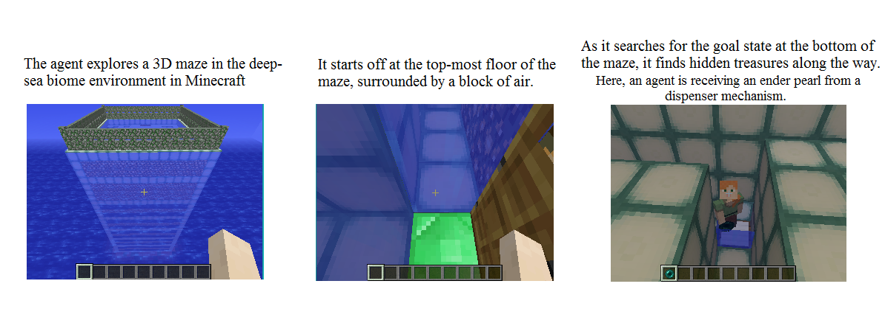

## Summary ##
An application of reinforcement learning to a scuba diving agent in Minecraft. Four our project, we implement a Q-learning agent that is completely submerged in a water world. In each episode, the agent (or in this case, our scuba diver) will dive into and explore uncharted waters, looking for treasures hidden throughout the map with, but with one little caveat-- it's scuba diving equipment is broken! The agent will have to rely on it's scuba-diving skills, prior knowledge, and the capacity of air it has left in its lungs to safely navigate to the goal in time. But who could pass up the offer of hidden treasures? Our agent must decide whether its worthwhile to explore and find more treasure, or to proceed on to the goal point. 

For this problem, we attempt to expand on the Q-learning algorithm to the double Q-learning algorithm in order to solve the known problem of maximum bias with a single Q-learner. We experiment our algorithms on three, unique maps. The first map has 3 floors, the second has 5 floors, and the third has 10 floors. All are scattered with rewards (as well as air pockets) to drive the incentive of our agent to explore its surroundings. Our main goal is to maximize the amount of rewards our agent receives, as well as experimenting with and evaluating the effects that depth has on the environment. 

## Screenshots ## 

# Code repository #
- [code repository](https://github.com/andrewdoh/scuba_diver)

# Referenced resources # 
### Book ###
- [Sutton and Barto: Introduction to Reinforcement Learning](http://incompleteideas.net/sutton/book/bookdraft2016sep.pdf)

### Minecraft ###
- [Malmo Github](https://github.com/Microsoft/malmo) 

- [Malmo Gitter](https://gitter.im/Microsoft/malmo) 

- [Malmo API Documentation](https://microsoft.github.io/malmo/0.21.0/Documentation/index.html) 

### Research articles and etc. ###
- [Q-learning wikipedia article](https://en.wikipedia.org/wiki/Q-learning) 

- [Double Q-learning summary](https://hadovanhasselt.files.wordpress.com/2015/12/doubleqposter.pdf) 

- [Double Q-learning research article](https://papers.nips.cc/paper/3964-double-q-learning.pdf) 

