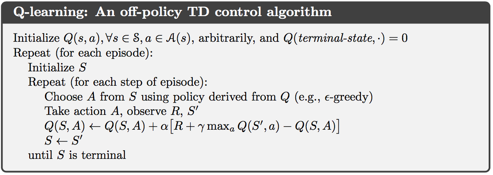
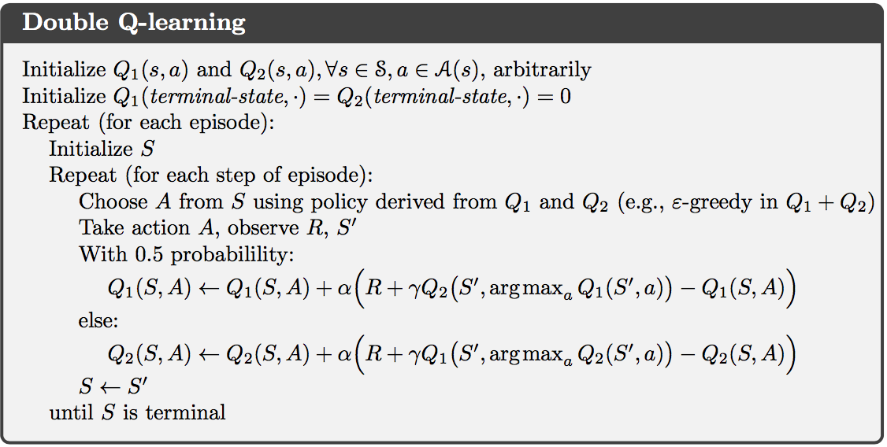
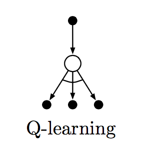
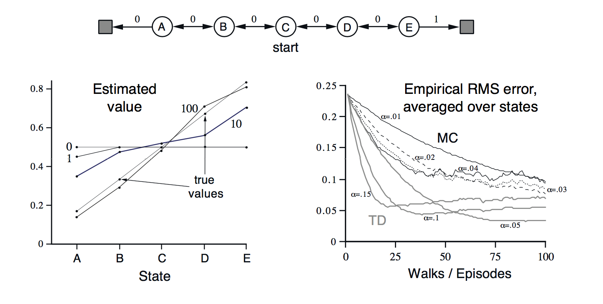
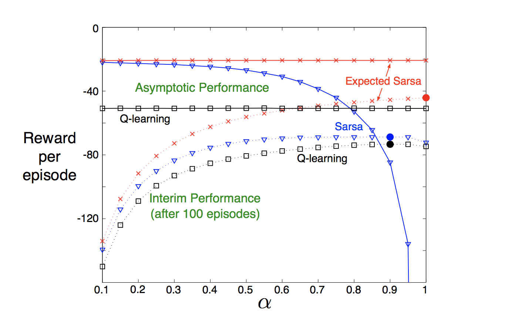
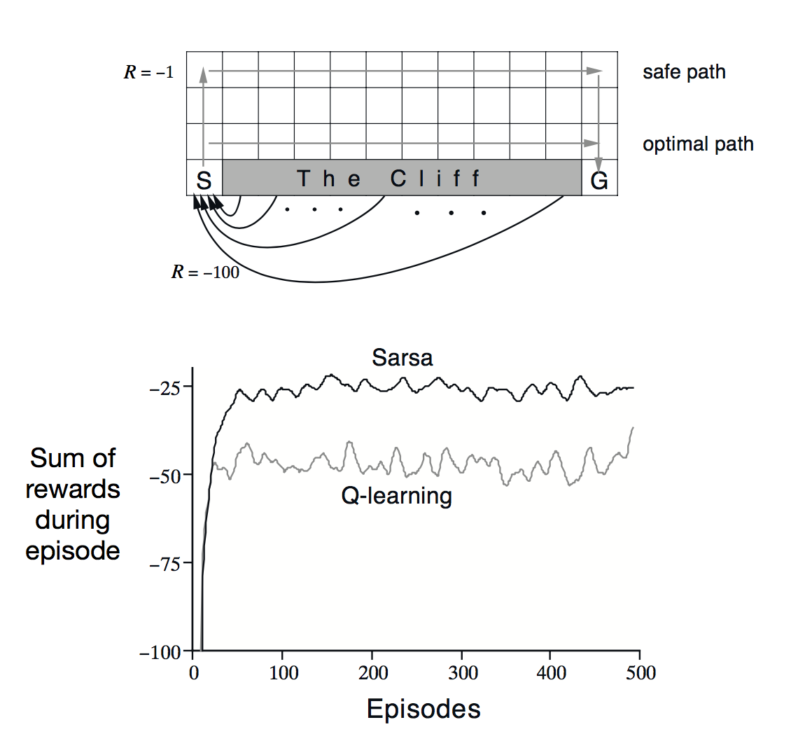
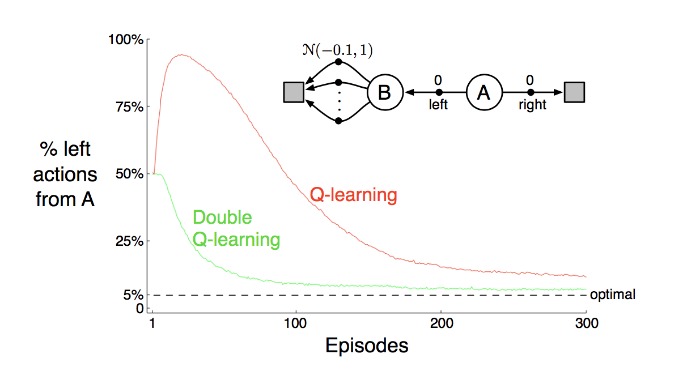

<iframe width="560" height="315" src="https://www.youtube.com/embed/otJyhsSgTw8" frameborder="0" allowfullscreen>
</iframe>

### Technical Description ###

## Project Summary ##
When we first began formulating an idea for the project, we initially wanted to teach the agent to learn how to shoot a air and bow efficiently using a convolutional neural network. We dove in head first trying to learn all we could about how to use a CNN with minecraft. However, as time progressed, we began to see we were way out of our depths in terms of knowledge about an already very complex model. So, we had to reevaluate our goals and decided it was best to reduce the complexity of our project but still have an interesting idea to apply to minecraft. With the class being about reinforcement learning, we thought it would a be cool idea to use Q-learning as the basis of our project. The general idea is to use a single Q-learning algorithm and let the agent learn and gather data. Then, we will implement double Q-learning algorithm to fix the inefficiencies with just a single Q-learning algorithm. Once this is done we will make a comparison of the two types, highlighting the pros, cons and differences between them. A more general explanation of our new project from the minecraft perspective is an agent that explores a 3D underwater maze in search treasure but with a limited amount of resources. This might sounds like assignment 2 but there are some key differences to which we apply the algorithm and variables that provide for some very interesting problems. The first problem being that to navigate a 3D maze, we must allow the agent to move in 3 dimensions. Instead of having the 4 standard states (forward, backward, left, right), we now have 6 states which includes moving up and moving down. The second major difference is that we introduced a new resource that needs to be managed by the agent in the form of air. Now, the agent has to decided whether it has enough air to keep exploring and find more treasure or to reach the goal without drowning. Currently, our group is testing the agent with only two floors enabled because it is more efficient for testing our algorithm and it has a state space large enough for us to understand its scale but small enough so that it won’t take us a long time to get the agent to final goal. 

## Approach ##
#### intro paragraph ####
For our project, we use Q-learning as the basis for our agent to explore a custom made map that is based on the deep sea biome environment with a tower submerged at its depths. As required for the progress report status, we have reduced the complexity of our project to demonstrate in a timely manner the proof of a functioning agent but in the final version of our project the map will consist of six levels of map exploring goodness. It in finalized form, the map will feature a few familiar characteristics analogous to the typical reinforcement learning environments. Namely, it will contain a start block, end block, obstacles the agent will encounter, and a variety of treasures scattered throughout the map the agent can obtain. To increase the complexity of the project and make it more interesting, we've made the modifications the professor advised and transitioned from a 2D space to 3D space. This transition of state and increase in depth of the map provide several interesting problems that need to be addressed in order for our Q-learning algorithm to work efficiently. Describing the map in more detail, the starting block is an emerald block located on the top floor of the tower, while the end block is a redstone block that is currently on the last floor of the tower. In between these levels are a variety of mazes and obstacles the agent must explore to learn how best to efficiently utilize its resources to find the optimal policy. These treasure consist of small pressure plate the agent must step on so that the mechanism releases the treasure. The value of each treasure is currently 10 but we are still experimenting with different value to assess if we can find an optimal assignment. Initially we had thought of adding potions as a form of reward for the agent to find but ran into complications with minecraft and the Malmo API and settled for providing blocks represented as wooden doors that provide air to the agent when stepped into. Naturally, this brings into question the problem of an agent that learns of this and abuses this information by simply staying in this location for the duration of the episode. So, to counteract this effect we've made the reward for air only occur once to incentivize the agent to keep exploring for more treasure and the final goal. If the agent can preserve and find the redstone block, it will be reward 100 points to its current total and end the current episode. The main objective of our project is to show an analysis of a single Q-learning algorithm, double Q-learning algorithm, and a comparison of the two to exhibit the differences and advantages made with transitioning to a double Q-learning algorithm. 
 
 
 

#### first paragraph topic single Q-learning algorithm implementation details and difficulties ####

#### second paragraph topic double Q-learning algorithm implentationd details and difficulties ####

#### maybe dicussion of single Q-learning vs double Q-learning ? not sure what to write here ####

#### conclusion paragraph ####

## Evaluation ##
The evaluation of our project will be an analysis of a single Q-learning algorithm and double Q-learning algorithm followed by a comparison between the two. We will begin by collecting various types of data for each algorithm. Since we're using a reinforcement learning algorithm, the main metrics by which we will gauge our project will in terms of $$\alpha$$, actions, episodes, and rewards. During each episode we take note of the every aspect regarding our agent. Using this data, we will analyze and perform a variety of different metrics both quantitative and qualitative to demonstrate that they are performing as intended. Following this, we will compare the two algorithms showing the deficiencies with a single Q-learning algorithm and the improvements made with the double Q-learning algorithm. The single Q-learning algorithm tends to overestimating current action values given that is a greedy algorithm which tends to lead to maximization bias. This would be an interesting event to see and analyze the circumstances leading to as the number of episodes increase. Additionally, when our prototype is completed, an analysis will be done to see how quantitatively how the problems with a 3D state space were effect when function approximation is applied. In closing, the Q-learning algorithm has an abundance of interesting properties which is why we chose to use this algorithm. 

## Remaining Goals and Challenges ##
While it’s a bit premature to state, the remaining goals and challenges we have for remaining days till the final submission are to make the necessary modifications to make our prototype fully functional. More specifically, as our project currently stands, it currently never converges to the optimal policy from the small amounts of testing we’ve done. With the modifications we’ve made to make this project to make it interesting, namely, the change from 2D action space to 3D, this was to be expected. To fix this problem, we initially had thought of doing some form of function approximation methods such as a neural network, linear approximation and etc. However, after some more research and meetings with the teaching assistant we’ve come to realize that our initially ideas were a bit overkill for the problem. While the ideas of using a neural network or some other popular form of function approximation seem very appealing and exciting, the sheer amount of time needed to understand and produce a functioning prototype are beyond the amount of time we have for this project. So instead, to fix this problem, we create a more simple function approximator that computes the target in terms of distances to items. From our analysis, we can see that the agent, with it’s current possible action space, seems to take unnecessary actions that yield no additional information. For example, given an episode in the initial rounds, the agent will take a path to previously visited location with no treasures or pockets of air and just randomly walk and get stuck in that particular location for an extended period of time instead of going to exploring for more treasure. This would seem to indicate that the amount of data currently being gathered is too much for the agent to handle, which is where our function approximation comes in. Rather than takes unnecessary actions our function approximator will target distances to items to alleviate the problem our agent has with taking unnecessary explorations of previously visited states. This naturally brings into question how the function will affect the amount of exploration the agent will do now. We hypothesis that there will a slight decrease in amount of exploration that will be done but not so much as to affect negatively the cumulative reward. To verify our expectations, we will provide a comparison of the different implementations we’ve made with a variety of different graphs. In regards to our current experiences, we anticipate the problems that will arise by the time the final report is due are that thinking of an idea and implementing it encompass many more problems that one might expect. While idea are simple to state, there are many problem that arise when the combination of so many different technologies are involved. We’ve realized that now after finally becoming somewhat familiar with the Malmo API. While we don’t know for certain how crippling this problem might be, we believe we’ve taken the necessary precautions to maximize our chances of completing our goal, namely, not implementing a already complex method(Neural Network), to solve a relatively simple problem. We do expect problems to arise with the more relatively simple function approximator but expect that by reducing the complexity of the proposed method that the problems that arise should be simple to solve as well. In conclusion, with our current progression of the project we don’t expect the remaining problems will cause a roadblock to our remaining goals like we previously had with our initial assumptions and expect to finish the project in a timely manner. 

### Algorithm ###
#### Q-learning algorithm ####
$$ Q(s_t,a_t)  \leftarrow \underbrace{Q(s_t,a_t)}_{\text{old value}} + \underbrace{\alpha_t}_{\text{learning rate}} \cdot \Bigg(\overbrace{\underbrace{r_{t+1}}_{\text{reward}} + \underbrace{\gamma}_{\text{discount factor}} \cdot \underbrace{\max\limits_{a} Q(s_{t+1},a)}_{\text{estimate of optimal future value}}}^{\text{learned value}}   - \underbrace{Q(s_t,a_t)}_{\text{old value}}  \Bigg)$$
#### Psuedocode ####

#### Double Q-learning algorithm ####
$$ Q_{1}(s_t,a_t)  \leftarrow \underbrace{Q_{1}(s_t,a_t)}_{\text{old value}} + \underbrace{\alpha_t}_{\text{learning rate}} \cdot \Bigg(\overbrace{\underbrace{r_{t+1}}_{\text{reward}} +  \underbrace{\gamma}_{\text{discount factor}} \cdot \underbrace{Q_{2} \big(s_{t+1},\max\limits_{a} Q_{1}(s_{t+1},a)\big)}}^{\text{learned value}}_{\text{estimate of optimal future value}}  - \underbrace{Q_{1}(s_t,a_t)}_{\text{old value}}  \Bigg)$$
$$ Q_{2}(s_t,a_t)  \leftarrow \underbrace{Q_{2}(s_t,a_t)}_{\text{old value}} + \underbrace{\alpha_t}_{\text{learning rate}} \cdot \Bigg(\overbrace{\underbrace{r_{t+1}}_{\text{reward}} +  \underbrace{\gamma}_{\text{discount factor}} \cdot \underbrace{Q_{1} \big(s_{t+1},\max\limits_{a} Q_{2}(s_{t+1},a)\big)}}^{\text{learned value}}_{\text{estimate of optimal future value}} - \underbrace{Q_{2}(s_t,a_t)}_{\text{old value}}  \Bigg)$$
#### Psuedocode ####

